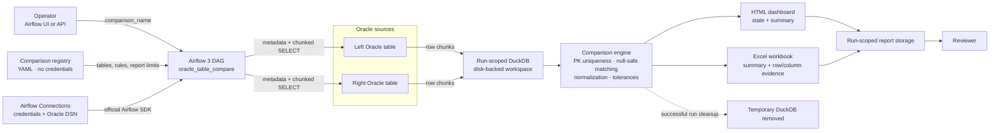

# DuckComparator User Guide

DuckComparator compares two Oracle tables through Apache Airflow 3 and produces an operator-friendly HTML dashboard plus an Excel evidence workbook. It is designed for scheduled reconciliations containing roughly 2–10 million rows, while keeping database credentials in Airflow rather than in configuration files.

This guide is for:

- Data engineers who install and operate the Airflow package.
- Database administrators who configure Oracle access.
- QA engineers and reconciliation operators who run comparisons and review evidence.

## Architecture



The architecture separates three kinds of information:

- Airflow Connections hold credentials and network details.
- YAML holds comparison intent: connection IDs, table identities, rules, and report limits.
- Run directories hold temporary DuckDB data and completed reports.

### Component responsibilities

| Component | Responsibility |
|---|---|
| Airflow DAG | Orchestrates one named comparison and creates run-scoped paths. |
| YAML registry | Defines reusable comparisons without storing credentials. |
| Airflow Connections | Securely provide Oracle usernames, passwords, hosts, ports, and service details. |
| Oracle extractor | Discovers primary-key metadata and streams each source in chunks. |
| DuckDB workspace | Stages source data on disk and executes joins and difference calculations. |
| Comparison engine | Rejects duplicate keys and applies null-safe, normalized comparisons. |
| Report generator | Creates the HTML dashboard and Excel evidence workbook. |

## How a run works

1. An operator triggers the DAG with a `comparison_name`.
2. The DAG loads that entry from the YAML registry.
3. It obtains both Oracle connections through the official Airflow 3 SDK.
4. It uses the configured primary key or discovers matching declared Oracle primary keys.
5. Both source tables are read in chunks and staged in a run-scoped DuckDB file.
6. The engine validates key uniqueness and performs the comparison.
7. HTML and Excel reports are written to a run-scoped output directory.
8. After a successful run, the temporary DuckDB file is deleted. A failed run keeps its workspace for diagnosis.

## Production prerequisites

Before deployment, confirm that every Airflow worker running the task has:

- Python 3.10 or newer.
- Apache Airflow 3.
- Network access to both Oracle databases.
- This package installed.
- Read access to the YAML registry.
- Write access to the workspace and report locations.
- Enough local workspace capacity to stage both source tables plus DuckDB working data.

Docker is not required in production. It is only a reproducible local test environment.

## Install the package

Build a wheel from a controlled checkout:

```text
python -m build
```

Install that wheel on every Airflow worker:

```text
pip install dist/oracle_table_compare-0.1.0-py3-none-any.whl
```

For a controlled development environment, installation from the checkout is also supported:

```text
pip install .
```

Copy `dags/oracle_table_compare.py` into the Airflow DAGs folder.

## Configure Oracle connections

Create one Airflow Connection for each Oracle source. The YAML registry refers to these by Connection ID.

Set the connection fields as follows:

| Airflow field | Oracle value |
|---|---|
| Connection ID | Stable name used in YAML, such as `oracle_prod`. |
| Host | Oracle server hostname. |
| Port | Listener port; defaults to `1521` when omitted. |
| Login | Oracle username. |
| Password | Oracle password. |
| Schema | Oracle service name, if Extra does not provide it. |
| Extra | Optional `{"service_name":"..."}` or complete `{"dsn":"..."}`. |

Do not put a username, password, host, DSN, or secret in the YAML registry.

The Oracle account needs permission to:

- Select from the configured source table.
- Read primary-key metadata through Oracle's accessible constraint views when key discovery is used.

## Configure worker paths

Set these environment variables for the Airflow worker process:

| Variable | Required | Purpose |
|---|---:|---|
| `TABLE_COMPARE_CONFIG` | Yes | Absolute path to the central YAML registry. |
| `TABLE_COMPARE_OUTPUT` | Yes | Durable report root accessible to report consumers. |
| `TABLE_COMPARE_WORKSPACE` | No | Root for temporary DuckDB files; defaults to `/tmp/table-compare`. |

Each run uses paths beneath these roots:

```text
<workspace>/<comparison_name>/<run_id>/comparison.duckdb
<output>/<comparison_name>/<run_id>/<comparison_name>.html
<output>/<comparison_name>/<run_id>/<comparison_name>.xlsx
```

Use worker-local fast storage for `TABLE_COMPARE_WORKSPACE`. Use durable shared or published storage for `TABLE_COMPARE_OUTPUT` when users need access after the task finishes.

## Create a comparison

Add a named entry to the central YAML registry:

```yaml
comparisons:
  customer_master:
    description: Customer master reconciliation
    left:
      connection: oracle_prod
      schema: CRM
      table: CUSTOMER
    right:
      connection: oracle_uat
      schema: CRM
      table: CUSTOMER
    primary_key: [CUSTOMER_ID]
    exclude_columns: [LAST_UPDATED_AT]
    rules:
      trim_strings: true
      case_sensitive: false
      numeric_tolerance: 0.0001
    report:
      detail_row_limit: 500000
```

### Registry field reference

| Field | Required | Meaning |
|---|---:|---|
| `description` | No | Human-readable explanation shown in the report. |
| `left.connection` | Yes | Airflow Connection ID for the left Oracle source. |
| `left.schema` | Yes | Left Oracle schema or owner. |
| `left.table` | Yes | Left Oracle table or view. |
| `right.connection` | Yes | Airflow Connection ID for the right Oracle source. |
| `right.schema` | Yes | Right Oracle schema or owner. |
| `right.table` | Yes | Right Oracle table or view. |
| `primary_key` | No | Ordered shared key columns. When omitted, matching declared Oracle primary keys are discovered. |
| `exclude_columns` | No | Columns ignored during value comparison. Key columns are excluded automatically. |
| `rules.trim_strings` | No | Trims leading and trailing whitespace before comparing strings. Default: `true`. |
| `rules.case_sensitive` | No | Controls case-sensitive string comparison. Default: `true`. |
| `rules.numeric_tolerance` | No | Maximum absolute numeric difference treated as equal. No tolerance is applied when omitted. |
| `report.detail_row_limit` | No | Maximum rows written to each evidence sheet. Default: `500000`. |

### Primary-key behavior

- Explicit keys are useful for views, undeclared keys, or controlled business keys.
- Composite keys are written in order, for example `[ORDER_ID, LINE_NUMBER]`.
- When `primary_key` is omitted, both Oracle tables must declare the same ordered primary-key columns.
- The run fails if either source contains duplicate values for the resolved key.

Duplicate-key rejection is intentional: without a unique key, row-to-row evidence would be ambiguous.

## Trigger a comparison

The supplied DAG is manually triggered by default. In the Airflow UI, trigger `oracle_table_compare` with this configuration:

```json
{"comparison_name": "customer_master"}
```

The name must match an entry beneath `comparisons` in the YAML registry.

When the task succeeds, its result contains:

```json
{
  "html_report": "<path-to-report>.html",
  "excel_report": "<path-to-report>.xlsx"
}
```

To schedule comparisons, deploy an organization-specific scheduled DAG or adjust the supplied DAG schedule and comparison selection according to your Airflow deployment practices.

## Read the HTML dashboard

The HTML report is the starting point for review. It is static, self-contained, responsive, printable, and has no external JavaScript or web resources.

### Comparison state

- **MATCH** means every distinct key and compared value agrees.
- **DIFFERENCES FOUND** means at least one changed matched row, left-only key, or right-only key exists.

State is communicated with text and a symbol as well as color.

### Row coverage

| Metric | Meaning |
|---|---|
| Left rows | Total staged rows from the left source. |
| Right rows | Total staged rows from the right source. |
| Matched keys | Keys present in both sources, whether values match or differ. |
| Exact-row match rate | Exact matching rows divided by all distinct keys across both sources. Empty-versus-empty is shown as 100%. |

### Exceptions

| Metric | Meaning |
|---|---|
| Changed matched rows | Keys present on both sides with at least one different compared value. |
| Left only | Keys found only in the left source. |
| Right only | Keys found only in the right source. |
| Changed columns | Number of matched rows that differ for each compared column. |

## Use the Excel evidence workbook

The workbook supports detailed investigation:

| Sheet | Contents |
|---|---|
| `Summary` | State, source identities, Connection IDs, primary key, totals, exceptions, and match rate. |
| `Changed columns` | Every changed column and its difference count. |
| `Left only` | Source rows whose keys appear only on the left. |
| `Right only` | Source rows whose keys appear only on the right. |
| One sheet per changed column | Primary-key columns, `left_value`, and `right_value`. |

Evidence sheets are capped by `report.detail_row_limit`. Counts in the summary remain complete even when displayed evidence is capped.

Recommended investigation order:

1. Confirm the source schema, table, Connection ID, and primary key on `Summary`.
2. Review left-only and right-only counts for missing or extra records.
3. Use `Changed columns` to identify the most affected fields.
4. Open a changed-column sheet to inspect exact keys and left/right values.
5. If a sheet reaches the configured detail limit, narrow the comparison or use a downstream full-detail export workflow before drawing conclusions from the sample alone.

## Comparison rules and Oracle semantics

- `NULL` equals `NULL`.
- A null on only one side is different.
- Oracle empty strings arrive as nulls and follow the null rule.
- String trimming and case folding happen only when enabled in the registry.
- Numeric tolerance uses the absolute difference between two non-null numbers.
- Key joins are null-safe, including composite keys.
- Only columns present on both sources are compared.
- Key columns and configured excluded columns are not compared as values.

If a column's data type differs materially between sources, align the Oracle projections or schemas before relying on the result.

## Capacity and operations

DuckDB is intentionally disk-backed, so comparison size is not limited to worker memory. Oracle reads are chunked, but the worker still needs enough disk for both staged sources and comparison working data.

For a new large comparison:

1. Measure both Oracle tables and estimate their extracted width.
2. Run a representative lower-environment comparison.
3. Observe peak workspace usage and duration.
4. Set worker concurrency so simultaneous comparisons cannot exhaust the workspace volume.
5. Apply retention rules to report storage independently of temporary workspace cleanup.

The included scale smoke test validates a two-million-row disk-backed comparison, but production performance depends on row width, column count, source latency, worker storage, and concurrent workload.

## Troubleshooting

### Comparison name not found

Confirm that `comparison_name` exactly matches a key under `comparisons` and that every worker reads the intended `TABLE_COMPARE_CONFIG` file.

### Airflow connection cannot be loaded

Confirm that the Connection ID exists in the same Airflow deployment as the worker and matches the YAML spelling. Verify that the connection has a service name or complete DSN.

### Oracle connection fails

Check worker network routing, host, port, service name or DSN, credentials, and Oracle account status. Credentials belong in the Airflow Connection, not in YAML.

### Primary key cannot be discovered

Either grant access to the relevant Oracle constraint metadata or configure `primary_key` explicitly. Views commonly require an explicit key.

### Sources declare different primary keys

Confirm that the tables are genuinely comparable. If they share a stable business key, configure that ordered key explicitly on both sides.

### Duplicate primary-key error

Find and resolve duplicate key values in the named source. Do not bypass the error unless the comparison design is changed to use a genuinely unique composite key.

### Worker runs out of disk

Increase `TABLE_COMPARE_WORKSPACE` capacity, reduce concurrent comparisons, or move the workspace to a larger worker-local volume. A failed run intentionally retains its DuckDB file, so remove diagnosed failed-run workspaces according to your operational retention process.

### Report evidence stops at the configured limit

The summary counts are complete; only workbook detail is capped. Increase `report.detail_row_limit` cautiously because Excel has practical worksheet and usability limits.

### A timestamp or number differs unexpectedly

Confirm that both source columns use compatible Oracle types and precision. Use `numeric_tolerance` only when the business rule permits it. Timestamp normalization beyond the common extracted representation should be handled in a controlled source view or a future explicit normalization rule.

## Local verification

Run the complete local test harness:

```text
docker build -t oracle-table-compare .
docker run --rm oracle-table-compare
```

Generate sample reports without Oracle:

```text
python examples/generate_sample_report.py
```

The sample files are written to `outputs/sample`.

Run the fixed two-million-row smoke test in an environment where the package and development dependencies are installed:

```text
python scripts/scale_smoke.py
```

## Security checklist

- Keep credentials only in Airflow Connections or the deployment's supported secret backend.
- Restrict registry edits because table identities and comparison rules affect evidence.
- Restrict report access because row-level business data may appear in Excel.
- Use encrypted storage and transport according to organizational policy.
- Review failed-run workspaces before deletion; they can contain staged source data.
- Do not publish report directories as anonymous web content.

## Quick operator checklist

Before trusting a result:

- Confirm the comparison name and description.
- Confirm both schema/table identities and Airflow Connection IDs.
- Confirm the resolved primary key.
- Read the explicit MATCH or DIFFERENCES FOUND state.
- Review left-only, right-only, and changed matched-row counts.
- Check per-column counts and Excel evidence for exceptions.
- Note the evidence row cap before assuming a sheet contains every detailed row.
